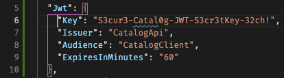

# Catalog TEC PAY

Modulo fullstack de administración de catálogos de productos. 

---

## Cómo correr el proyecto

### Requisitos previos

|Herramienta|Versión mínima|
|---|---|
|.NET SDK|9.0|
|Node.js|20.x|
|Angular CLI| 20.x(npm install -g @angular/cli)|

---
### Backend 

```bash
# Desde la raíz del repositorio
dotnet run
```
La API arranca en:
- **HTTP**: `http://localhost:<PORT>`
- **Swagger UI**: `http://localhost:<PORT>/swagger`
> Asegurate de tener varibles de Jwt en archivo. appsettings.json 
>


> La base de datos SQLite (`catalog.db`) se crea automáticamente al primer arranque
---
### Frontend

```bash
# Desde la raíz del repository 
ng serve
```
La aplicación queda disponible en: **`http://localhost:4200`**

> Asegúrate de que el backend esté corriendo antes de abrir el frontend.
> Asegúrate de que en caso de que el puerto del frontend cambie, modificar los CORS en el backend. 
> Favor de verificar la url y puerto del backend en el archivo environments/environment.ts.

---

### Test (backend)

```bash
# Desde la raíz del repositorio tec_pay_technical_tests
dotnet test catalog_back.sln
```
## Credenciales de acceso

| Rol | Email | Password | Permisos |
|---|---|---|---|
| **Admin** | `admin@catalog.com` | `Admin123!` | CRUD completo |
| **User** | `user@catalog.com` | `User123!` | Solo lectura |

---

## Tecnologías utilizadas

### Backend
| Paquete | Propósito |
|---|---|
| .NET Core 9 — Minimal API | Framework principal y exposición de endpoints |
| Entity Framework Core 9 + SQLite | ORM y base de datos embebida |
| MediatR 12 | Dispatcher CQRS (Commands y Queries) |
| AutoMapper 14 | Mapeo entre entidades y DTOs |
| FluentValidation 11 | Validaciones declarativas de Commands |
| Microsoft.AspNetCore.Authentication.JwtBearer 9 | Autenticación JWT Bearer |
| System.IdentityModel.Tokens.Jwt 8 | Generación de tokens JWT |
| Swashbuckle / OpenAPI | Documentación interactiva (Swagger UI) |
| NUnit 4 + Moq 4 | Unit testing |

### Frontend
| Tecnología | Propósito |
|---|---|
| Angular 20 (standalone components) | SPA, componentes y routing |
| Angular Signals | Gestión de estado reactivo |
| Angular Reactive Forms | Formularios con validaciones |
| RxJS 7 | Manejo de streams HTTP y operadores |
| HttpClient + Interceptors | Comunicación con la API y manejo global de errores |
| Angular Guards | Protección de rutas por rol |
---
## Arquitectura seleccionada: Clean Architecture

Se eligió **Clean Architecture** por las siguientes razones:

1. Separar las responsabilidades claramente. Cata capa tiene un propósito único y sus dependencias siempre son hacia el dominio DDD
2. Testabilidad. Esta arquitectura facilita el desarrollo de las pruebas unitarias asi como el uso de mocks dado que tenemos responsabilidades separadas, para trabajar productos **IProductRepository** y para persistir esos datos y cuidar de las transacciones **IUnitofWork**
3. Abierta a cambios(Escalable). Al tener una capa que se encarga de la configuración y la persistencia de los datos es fácil poder cambiarla, por ejemplo: se puedo cambiar la base de datos de sqlite a SQL Server o incluso funcionalidades a microservicios separados cambiando las features.

## Decisiones técnicas clave
## 1. Decisiones técnicas clave
### 1. Minimal API en lugar de MVC 
- En lugar del usar MVC se uso **Minimal API** de .net 9 con `RouteGroupBuilder`, debido a que esto nos ayudaría teniendo menos "paja" en cada definicion del controlador y el metodo. 
- Mejor performance al evitar el pipeline MVC 
- Mejor sintaxis y mas entendible para el equipo
### 2. CQRS con MediatR
Operaciones separadas de queries de lectura y commands de escritura, siguiendo este patron. 
- Controladores estan solo sirviendo(enrutan)
- Handler por responsabilidad (SOLID)
- Ayuda a agregar validaciones y logs dentro de nuestro ciclo de vida de la aplicación. 
### 3. Unit of Work 
Con este patron centralizamos el guardado de los diferentes cambios ejemplificados en el backend en un único punto. Siguiendo con las responsabilidades por patron, el patron repository no guarda nada por su cuenta esto permite:
- Operaciones atómicas que afectan multiples repositorios
- Mayor control de transacciones
- Repositorios mas limpios
### 5 Factory Mehtod de entidades del dominio
Constructores privados para entidades y métodos estáticos para `Create` como factory.
- Garantizan responsabilidades toda instancia se crea de la misma manera
- Id generado en dominio y producto activado igual en dominio por defecto
- Validación adiciona para prevenir que EF Core u otro código intente construir el objecto con estado invalido. 
#### 6. JWT y Policies 
- GET endpoints públicos.
- POST, PUT y Delete, requieren `AdminPolicy` que el usuario este autentificado. 
- Token incluye claims para ayudar a reducir las peticiones del frontend. 
### 7. Angular - Sigals para manejar el estado 
Al generar una store de productos en lugar de NgRx nos ayudo a:
- No tener boilerplate innecesaria.
- Angular 17+ nativo 
- Computed() para valores calculados. 
### 8. Interceptors funcionales (Angular)
Se usarn Interceptores funcional para: 
- Añadir header personalizados ejemplo: Authorization: Bearer... en cada request. 
- Capturar errores de session y redirigir al login. 
### 9. Lazy Loading 
Todas las rutas del frontend usan loadComponent() para cargar diferida. Reduciendo el bundle inicial. 

--- 

## Tests

El proyecto incluye **unit tests** en el backend usando **NUnit + Moq**:

- `CreateProductCommandHandlerTests` — 3 tests
  - Creación exitosa devuelve `ProductDto`
  - Categoría inexistente lanza `NotFoundException`
  - Nombre duplicado lanza `DomainException`
- `CreateCategoryCommandHandlerTests` — 2 tests
  - Creación exitosa devuelve `CategoryDto`
  - Nombre duplicado lanza `DomainException`

```bash
# Desde la raíz del repositorio tec_pay_technical_tests
dotnet test catalog_back.sln --logger "console;verbosity=normal"
```

--- 

## Postman 

Colección de postman agregada en el la carpeta `Documentation`

`Favor de cambiar los ids de prueba y los puertos en caso de ser necesario.` 